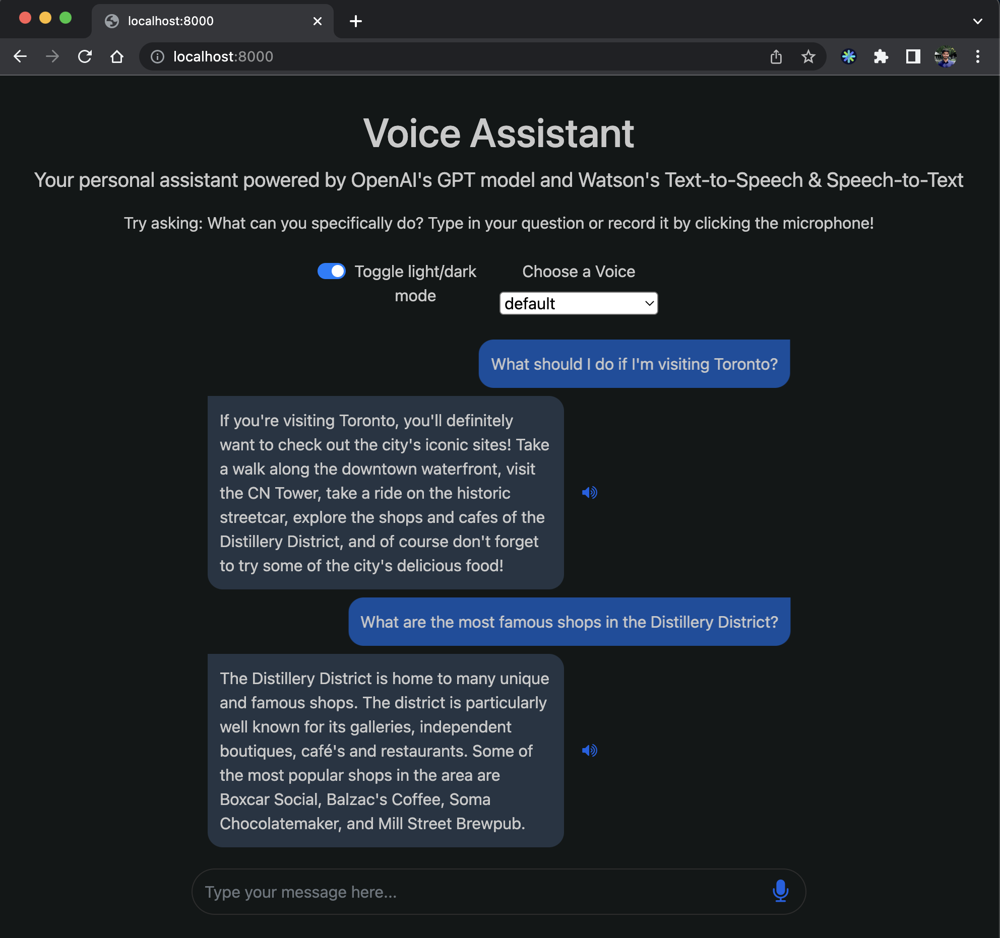

# Personal Assistant Chat Application Using OpenAI's GPT-3

Are you looking for a personal assistant that can understand and respond to your natural language commands and queries? Look no further! This project uses OpenAI's GPT-3 model to create a personal assistant that can interact with you via speech or text.

The project includes both Speech-to-Text and Text-to-Speech capabilities, allowing you to interact with the assistant in a natural, conversational way. The user interface is similar to a chat application, with typing animations and the ability to replay messages.

## Getting Started

Before you can start using the personal assistant, there are a few requirements and prerequisites that you'll need to take care of:

1. Obtain an API key from [OpenAI](https://beta.openai.com/account/api-keys).
2. Update the `openai.key` value in the [`worker.py`](./worker.py) file
3. Obtain an Entitlment Key from [IBM](https://myibm.ibm.com/products-services/containerlibrary).
4. Ensure [Docker](https://www.docker.com/) is installed in your system.

Once you have your keys and the models deployed, you can use the application by following the steps in the [Using the Pesonal Assistant](#using-the-personal-assistant) section.

## Using the Personal Assistant

To run the application in a Docker container, follow these steps:

1. Open the terminal and navigate to the root directory of the repository.
2. Export your IBM Entitlement Key and login to a specific Docker registry:

```sh
IBM_ENTITLEMENT_KEY=... # replace ... with your key
echo $IBM_ENTITLEMENT_KEY | docker login -u cp --password-stdin cp.icr.io
```

3. Run the following command:

```sh
docker compose up --build
```

_Check the logs to make sure that both the TTS and STT containers are running correctly by ensuring the logs display "INFO: Chuck server ready." as shown below:_

```sh
...
chatapp-with-voice-and-openai-stt-1      | "INFO: Chuck server ready."
...
chatapp-with-voice-and-openai-tts-1      | "INFO: Chuck server ready."
...

```

To stop the application, press `Ctrl` + `C` in the terminal where the `docker compose up` command was run. To tear down the containers and related resources, run:

```sh
docker compose down
```

**_For the smoothest experience, run `docker compose down` and `docker compose up --build` each time you want to test new changes to ensure the image is rebuilt with the latest changes._**

4. Open your browser and navigate to `http://localhost:8000` to interact with the Personal Assistant. You can then speak your queries by clicking on the microphone or typing into the message bar. The assistant will then respond with a message and read the message outloud.

**Note: Any changes made to the files will require rebuilding and rerunning the service.**

## Note

- Make sure to keep your API keys secure and not to share them with anyone.
- Make sure the URLs are working and are correctly used in the code
- Make sure that the TTS and STT are ready to use (by checking their logs)

## Troubleshooting

If you experince an error lke:

```sh
requests.exceptions.ConnectionError: ('Connection aborted.', RemoteDisconnected('Remote end closed connection without response'))
```

This may indicate that the `TTS` or `STT` containers are not ready, please ensure the logs have each logged `"INFO: Chuck server ready."` before sending queries.

## Deploying these Images Globally

If you deploy the TTS and STT images globally, you'll need to update the `base_url` values in the `workey.py` file to be correctly configured to the new URL values. Please do not forget this when deploying globally.

## Additional Resources

- [OpenAI API documentation](https://beta.openai.com/docs/api-reference/introduction)
- [IBM Watson Text-to-Speech documentation](https://cloud.ibm.com/docs/services/text-to-speech)
- [IBM Watson Speech-to-Text documentation](https://cloud.ibm.com/docs/services/speech-to-text)
- [IBM Watson Speech GitHub](https://github.com/ibm-build-lab/Watson-Speech)

## Demo

Heres a quick video of planning a trip to Portugal with the Assistant. Audio output is not recorded but is there.

[demo-video](demo/demo.mov)

Here is a screenshot of the application in action in dark mode



## Conclusion

With the Personal Assistant, you can now interact with your computer in a natural and conversational way. We hope you find this project useful and enjoy using it as much as we enjoyed building it. Learn to build your own on [CognitiveClass.ai](https://cognitiveclass.ai/courses/chatapp-powered-by-openai)
